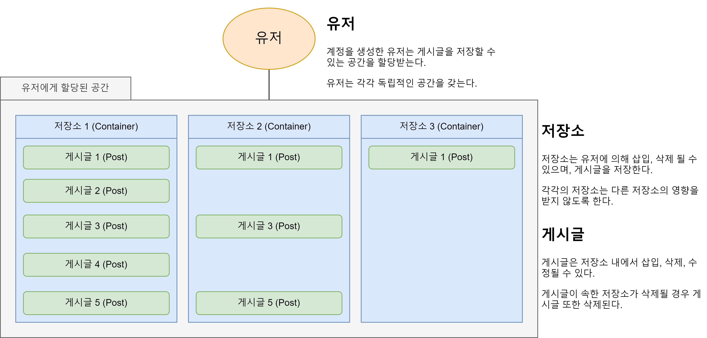
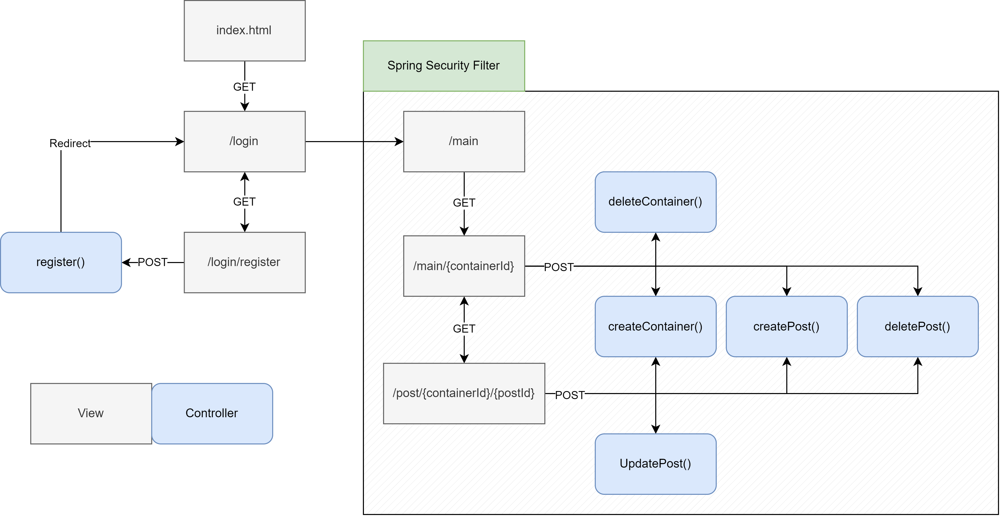
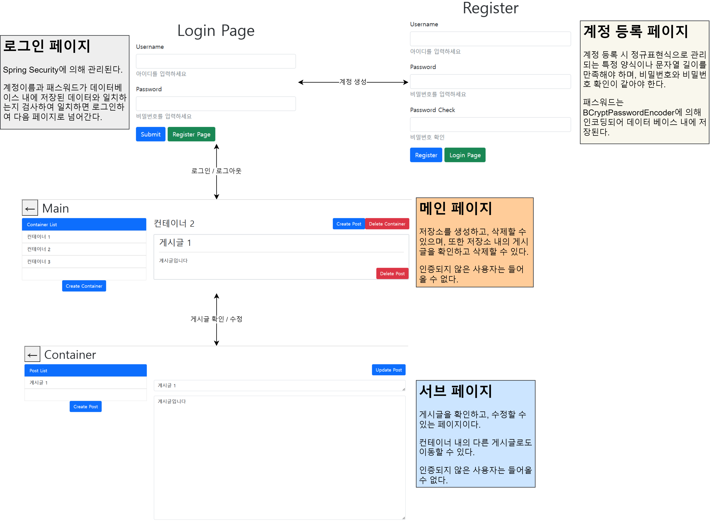
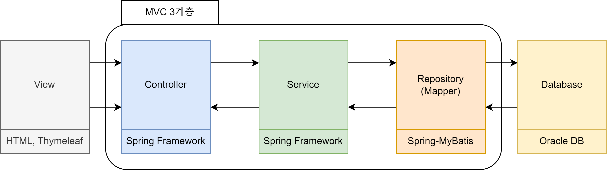
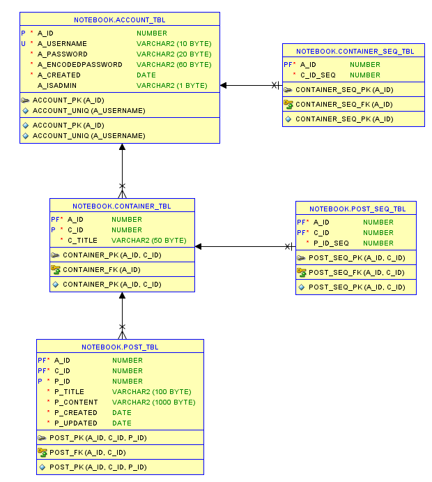

# SpringMVC_Practice

## 개요
- Spring Boot와 데이터베이스를 연동한 CRUD를 구현하는 개인프로젝트

## 목표
- 평소 사용하고 있던 노트 프로그램인 에버노트와 같이 각 유저에게 개인이 저장소를 나눠 게시글을 CRUD 할 수 있는 공간을 할당할 수 있는 웹 애플리케이션 작성

## 사용 기술
### BackEnd
- Spring Boot v2.7.10
- MyBatis
- Spring Security

### Database
- Oracle Database 19c

### FrontEnd
- HTML
- Thymleaf
- BootStrap v5.1

## View-Controller 와이어프레임

## 서비스 흐름도

## MVC 계층

- MVC 계층에 따라 URL 루팅을 관리하는 Controller, 비즈니스 로직을 관리하는 Service, DAO를 관리하는 Repository 계층으로 코드를 나누어 진행함.

## DB 구조

- 계정 정보를 저장하는 ACCOUNT_TBL, 저장소를 저장하는 CONTAINER_TBL, 게시글을 저장하는 POST_TBL을 생성함.
- 각 저장소와 포스트에 독립적인 키를 할당하기 위해 CONTAINER_SEQ_TBL와 POST_SEQ_TBL을 추가적으로 만들어 관리함.

## 추가로 해야할 거...
- 검증(Validation) 코드 다시 짜기
- ...